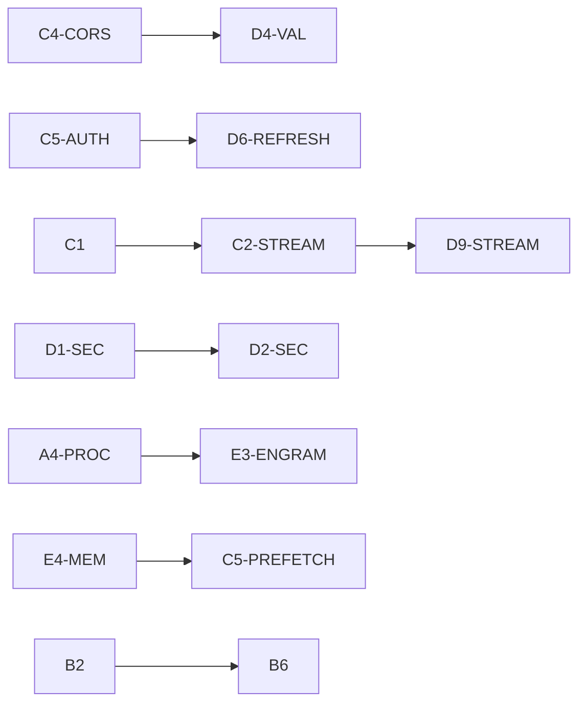

# Audit Remediation v1 — Technical Design

**Change:** `audit-remediation-v1`
**Date:** 2026-05-26

---

## Architecture Overview

```
┌─────────────────────────────────────────────────────────────────────┐
│                  AUDIT REMEDIATION IMPACT MAP                       │
│                                                                     │
│  ┌──────────────┐    ┌──────────────────┐    ┌──────────────────┐  │
│  │  SaaS         │    │  Desktop          │    │  Agent            │  │
│  │  13 findings  │    │  7 findings       │    │  15 findings      │  │
│  │               │    │                   │    │                   │  │
│  │ ┌───────────┐ │    │ ┌───────────────┐ │    │ ┌───────────────┐ │  │
│  │ │ Security  │ │    │ │ Security      │ │    │ │ Memory Mgmt   │ │  │
│  │ │ C4-CORS   │ │    │ │ D1-SEC        │ │    │ │ A1,A6,E2      │ │  │
│  │ │ C5-AUTH   │ │    │ │ D2-SEC        │ │    │ │ C5-PREFETCH   │ │  │
│  │ │ D3-RATE   │ │    │ └───────────────┘ │    │ └───────────────┘ │  │
│  │ │ D4-VAL    │ │    │ ┌───────────────┐ │    │ ┌───────────────┐ │  │
│  │ │ D5-INPUT  │ │    │ │ Process Mgmt  │ │    │ │ Context Mgmt  │ │  │
│  │ │ D7-RATE   │ │    │ │ A4-PROC       │ │    │ │ B3,B4,B2      │ │  │
│  │ └───────────┘ │    │ │ E3-ENGRAM     │ │    │ │ E5-PROMPT     │ │  │
│  │ ┌───────────┐ │    │ └───────────────┘ │    │ │ B6,B1         │ │  │
│  │ │ Billing   │ │    │ ┌───────────────┐ │    │ └───────────────┘ │  │
│  │ │ C1        │ │    │ │ UX/Perf       │ │    │ ┌───────────────┐ │  │
│  │ │ C2-STREAM │ │    │ │ E1-SSE        │ │    │ │ Performance   │ │  │
│  │ │ C3-TOKEN  │ │    │ │ E1-CHAT       │ │    │ │ E4-MEM,PC1    │ │  │
│  │ └───────────┘ │    │ └───────────────┘ │    │ │ E4-FTS        │ │  │
│  │ ┌───────────┐ │    │                   │    │ └───────────────┘ │  │
│  │ │ Schema    │ │    │                   │    │                   │  │
│  │ │ D8-CSP    │ │    │                   │    │                   │  │
│  │ │ D9-STREAM │ │    │                   │    │                   │  │
│  │ │ D10,D11   │ │    │                   │    │                   │  │
│  │ │ D12       │ │    │                   │    │                   │  │
│  │ └───────────┘ │    │                   │    │                   │  │
│  └──────────────┘    └──────────────────┘    └──────────────────┘  │
└─────────────────────────────────────────────────────────────────────┘
```

---

## Key Technical Decisions

### 1. Token Balance Atomicity (C1)

**Decision:** Use `prisma.license.updateMany` with conditional WHERE clause instead of `$transaction`.

**Rationale:** `updateMany` with `WHERE tokenBalance >= cost` is a single atomic DB operation. No transaction overhead, no lock contention. Returns `count === 0` if balance insufficient, which maps cleanly to HTTP 402.

**Tradeoff:** Cannot return the updated balance in the same query (updateMany doesn't return records). Acceptable — balance can be fetched in a subsequent read if needed for the response body.

```typescript
// Atomic: deducts ONLY if sufficient balance
const result = await prisma.license.updateMany({
  where: { id: licenseId, tokenBalance: { gte: finalCost } },
  data: { tokenBalance: { decrement: finalCost } },
});
if (result.count === 0) return NextResponse.json({ error: "Insufficient balance" }, { status: 402 });
```

---

### 2. CORS Allowlist (C4-CORS)

**Decision:** Static Set-based allowlist stored in env vars + hardcoded production domains.

**Rationale:** Simple, zero-overhead at runtime. No regex parsing, no database lookups. The set of origins is small and well-known.

```typescript
const ALLOWED_ORIGINS = new Set([
  process.env.CORS_ALLOWED_ORIGIN || "https://app.omniworker.com",
  "https://flux.simplex.lat",
  ...(process.env.NODE_ENV === "development" ? ["http://localhost:3000"] : []),
]);
```

**If origin not in set:** Omit `Access-Control-Allow-Origin` and `Access-Control-Allow-Credentials` headers entirely. Don't set them to empty strings.

---

### 3. Refresh Token Family Chain (C5-AUTH)

**Decision:** Modify `createRefreshToken` to accept optional `existingFamily` parameter. Implement replay detection in `validateRefreshToken`.

**Key change:** When a revoked token is presented:
1. `revokeTokenFamily(family)` — invalidate ALL tokens in the chain
2. Return `null` — force re-login
3. Log security event

**This activates the existing dead code** (`revokeTokenFamily`) that was written but never called.

---

### 4. Streaming Billing Reconciliation (C2-STREAM)

**Decision:** Use `TransformStream` to count actual SSE chunks, reconcile billing after stream completes.

**Architecture:**
```
Provider → Response.body → TransformStream (counter) → Client
                                    ↓ (flush)
                           Reconcile: refund diff or charge extra
```

**Risk:** If stream aborts (client disconnect, provider error), `flush()` may not fire. Mitigation: deduct a conservative minimum upfront, reconcile the difference asynchronously.

---

### 5. webSecurity Removal (D1-SEC)

**Decision:** Remove `webSecurity: false`. Proxy API calls through main process IPC.

**Architecture:**
```
Renderer → IPC → Main Process → net.request() → SaaS API
```

**Tradeoff:** Adds IPC latency (~5-10ms per request). Acceptable for API calls that take 200ms+ anyway. Alternative (session.webRequest CORS injection) was considered but rejected because it requires maintaining URL patterns that can drift.

---

### 6. safeStorage for Credentials (D2-SEC)

**Decision:** Migrate from `localStorage` / plaintext `.env` to Electron's `safeStorage` API.

**Architecture:**
- `safeStorage.encryptString(token)` → store encrypted buffer in `electron-store`
- On read: `safeStorage.decryptString(buffer)`
- For spawned CLI processes: inject credentials via `env` option in `spawn()`, never write to `.env`

**Dependency:** Requires D1-SEC (webSecurity) to be done first, because without webSecurity:false the renderer can't make direct API calls anyway.

---

### 7. Auxiliary Context Validation (B3)

**Decision:** Pre-flight check: estimate compression prompt size vs auxiliary model context length. Truncate if exceeds 80%.

```python
aux_context = get_model_context_length(auxiliary_model)
prompt_estimate = estimate_tokens_rough(content_to_summarize + instructions)
if prompt_estimate > aux_context * 0.8:
    max_chars = int(aux_context * 0.8 * 4)
    content_to_summarize = content_to_summarize[:max_chars]
    logger.warning(f"Truncated: {prompt_estimate} tokens > 80% of {aux_context}")
```

---

### 8. Summary Failure Recovery (B4)

**Decision:** Change default to `abort_on_summary_failure=True`. Before dropping messages, persist to `~/.omniworker/recovery/`.

**Rationale:** Data loss is worse than a failed compression attempt. The user can retry compression or switch models. The recovery directory serves as a safety net for the opt-in `False` behavior.

---

### 9. Process Lifecycle (A4-PROC)

**Decision:** Remove `detached: true` from all child process spawns. Add startup orphan cleanup.

**Cleanup strategy:**
1. On app start: read PID file (`~/.omniworker/pids.json`), kill any still-running processes
2. On spawn: record PID in the file
3. On `will-quit`: await all cleanup with 5s timeout, then SIGKILL fallback
4. On unexpected crash: next startup handles cleanup via step 1

---

### 10. SSE Watchdog (E1-SSE)

**Decision:** setTimeout-based watchdog (90s) that resets on each `data` event.

```typescript
let watchdog: NodeJS.Timeout;
const resetWatchdog = () => {
  clearTimeout(watchdog);
  watchdog = setTimeout(() => {
    controller.abort();
    // Notify renderer: "Agent appears hung"
  }, 90_000);
};
res.on('data', (chunk) => {
  resetWatchdog();
  // ... process chunk
});
```

---

## Data Model Changes

### Prisma Schema (SaaS)

```diff
 model TaskLog {
   // ... existing fields
+  @@index([userId])
+  @@index([tenantId])
+  @@index([createdAt])
 }

 model MasterProvider {
   // ... existing fields
+  @@index([provider, isActive])
 }

 model RefreshToken {
   // ... existing fields
+  @@index([family])
 }

 model User {
   // ... existing fields
+  @@index([tenantId])
 }

 model SubscriptionPlan {
-  price    Float
+  priceInCents  Int    // was Float "price"
 }

 model Invoice {
-  amount    Float
+  amountInCents  Int   // was Float "amount"
 }
```

---

## Risk Mitigation

| Risk | Mitigation |
|------|------------|
| D1-SEC breaks desktop→SaaS communication | Test all API flows before merging. Keep webSecurity:false behind feature flag initially |
| D2-SEC safeStorage not available on all OS | Fallback to current behavior with warning log if `safeStorage.isEncryptionAvailable()` returns false |
| C2-STREAM TransformStream flush() not called on abort | Deduct minimum upfront; reconcile asynchronously via background job |
| B4 abort_on_summary_failure=True breaks existing workflows | Make it configurable via env var `OMNIWORKER_SUMMARY_ABORT=true` |
| D11-FLOAT Int migration breaks existing data | Write migration script that converts `Float * 100` → `Int`. Run in transaction. |

---

## Dependencies Between Fixes



**Dependency-free fixes** (can be parallelized): C4-CORS, D3-RATE, D7-RATE, D5-INPUT, B4, B3, D1-SEC, E1-SSE, A4-PROC, A6, C3-TOKEN, E4-MEM, B2, E2-THREAD, A1, E1-CHAT, D8-CSP, D10-SCHEMA, E5-PROMPT, E4-FTS, PC1, A3, B1, D12-CASCADE
